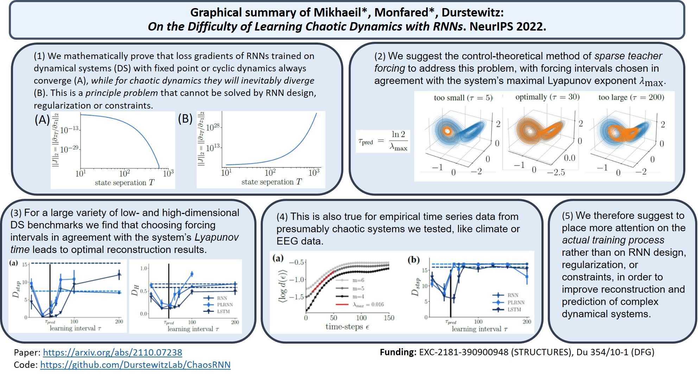

 *On the difficulty of learning chaotic dynamics with RNNs*
------

Code for the training of RNNs with sparsely forced BPTT. 

This folder contains the python code, data files and plots from 

["On the difficulty of learning chaotic dynamics with RNNs", Jonas Mikhaeil, Z. Monfared and D. Durstewitz](https://neurips.cc/virtual/2022/poster/53371).
```
@inproceedings{
mikhaeil2022on,
title={On the difficulty of learning chaotic dynamics with {RNN}s},
author={Jonas Magdy Mikhaeil and Zahra Monfared and Daniel Durstewitz},
booktitle={Advances in Neural Information Processing Systems},
editor={Alice H. Oh and Alekh Agarwal and Danielle Belgrave and Kyunghyun Cho},
year={2022},
url={https://openreview.net/forum?id=-_AMpmyV0Ll}
}
```
This package is distributed under the terms of the GNU GPLv3 & Creative Commons Attribution License. Please credit the source and cite the reference above when using the code in any form of publication.

--------------
main.py: Starts individual runs. 

ubermain.py: Allows to start multiple runs simultanously. Used to sweep parameters, such as the learning interval $\tau$. 

main_eval.py: Evaluates the reconstruction quality of (multiple) trained models and creates files such as klx.csv, which are used to create the plots in the paper.

CreateFigures.ipyn : code to create the figures from the csv files created in the model evaluation. 

Datasets: contains all datasets.

Figures: contains all figures. 
